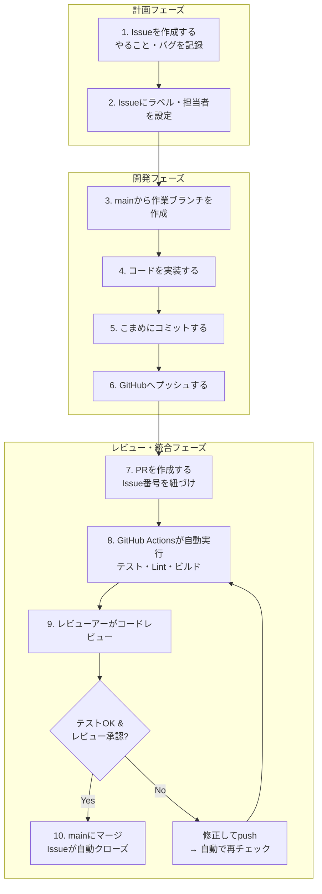
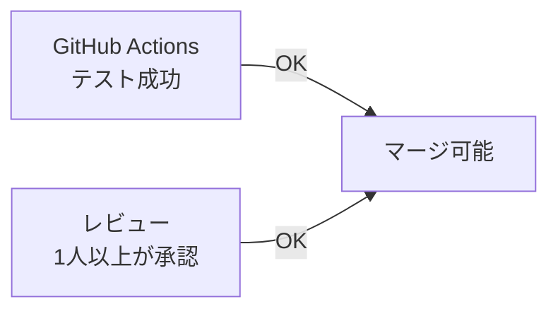
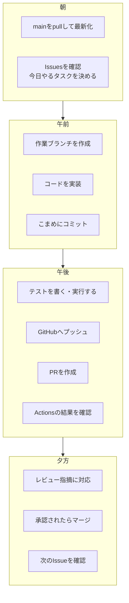

# GitHub活用 日常の作業フロー

Issues / Branch Protection / GitHub Actions を導入した場合、日々の開発作業がどのような流れになるかを具体的に示します。

---

## 全体の作業フロー



---

## 具体的な作業手順（シナリオ形式）

以下では「桂馬の動きにバグがある」という問題を例に、一連の流れを再現します。

---

### フェーズ1: 計画（Issue作成）

#### 手順 1-1: バグを発見したらIssueを作成

**GitHub画面で操作する場合:**

1. リポジトリの「Issues」タブを開く
2. 「New issue」をクリック
3. 以下を記入して「Submit new issue」

```markdown
タイトル: 桂馬が横に動けてしまうバグ

## 現象
桂馬が左右に1マス動けてしまう（本来は前方2マス+左右1マスのL字のみ）

## 再現手順
1. 桂馬を選択する
2. 合法手ハイライトに横1マスが含まれている
3. 実際に横に移動できてしまう

## 期待する動作
桂馬の合法手は前方2マス+左右1マスのL字型のみ

## 該当コード
src/engine/moveGenerator.ts の桂馬の動き定義
```

**CLIで操作する場合:**

```bash
gh issue create \
  --title "桂馬が横に動けてしまうバグ" \
  --body "## 現象
桂馬が左右に1マス動けてしまう。

## 再現手順
1. 桂馬を選択する
2. 合法手ハイライトに横1マスが含まれている

## 該当コード
src/engine/moveGenerator.ts" \
  --label "bug,shogi-engine"
```

#### 手順 1-2: ラベルと担当者を設定

```bash
# ラベルを追加
gh issue edit 12 --add-label "bug"

# 自分を担当者に設定
gh issue edit 12 --add-assignee "@me"
```

> Issueの番号（この例では #12）は作成時に自動で振られます。

---

### フェーズ2: 開発

#### 手順 2-1: mainから作業ブランチを作成

```bash
# mainの最新を取得
git checkout main
git pull origin main

# Issue番号を含むブランチを作成
git checkout -b fix/keima-movement-12
```

> ブランチ名にIssue番号を含めると、後で対応関係がわかりやすくなります。

#### 手順 2-2: コードを修正する

該当ファイルを編集して桂馬の移動ルールを修正します。

#### 手順 2-3: こまめにコミット

```bash
# 変更ファイルを確認
git status

# 修正したファイルをステージング
git add src/engine/moveGenerator.ts

# コミット
git commit -m "fix: 桂馬の合法手生成を修正（横移動を除去）"
```

テストも書いた場合は別コミットにすると履歴が見やすくなります。

```bash
git add src/engine/__tests__/keima.test.ts
git commit -m "test: 桂馬の移動ルールのテストを追加"
```

#### 手順 2-4: GitHubへプッシュ

```bash
git push -u origin fix/keima-movement-12
```

---

### フェーズ3: レビュー・統合

#### 手順 3-1: PRを作成

```bash
gh pr create \
  --title "fix: 桂馬の合法手生成を修正" \
  --body "$(cat <<'EOF'
## Summary
- 桂馬が横に動けてしまうバグを修正
- 桂馬の移動ルールのテストを追加

Fixes #12

## Test plan
- [ ] 桂馬が前方L字にのみ動けることを確認
- [ ] 桂馬が横・後ろに動けないことを確認
- [ ] 既存のテストが全てパスすることを確認
EOF
)"
```

> `Fixes #12` と書くことで、このPRがマージされるとIssue #12が自動クローズされます。

#### 手順 3-2: GitHub Actionsが自動実行される

PRを作成（またはpush）すると、自動でテストやLintが実行されます。

```
この時点で開発者がやることはありません。
GitHub上のPRページで結果を待つだけです。

  ci / test ............... 実行中（黄色の丸）
    ↓
  ci / test ............... 成功（緑のチェック） or 失敗（赤のバツ）
```

**もしテストが失敗した場合:**

```bash
# ローカルでテストを実行して原因を確認
cd shogi-app && npm test

# 修正してコミット & プッシュ
git add src/engine/moveGenerator.ts
git commit -m "fix: テスト失敗の修正 - 先手後手で桂馬の向きを考慮"
git push

# → pushすると自動で再度Actionsが実行される
```

#### 手順 3-3: レビューを受ける

レビューアーがコードを確認します。

**レビューで指摘があった場合の対応:**

```bash
# レビュー指摘に基づいてコードを修正
git add src/engine/moveGenerator.ts
git commit -m "fix: レビュー指摘対応 - コメントを追加"
git push

# → 再度Actionsが実行される
# → レビューアーが再確認
```

#### 手順 3-4: マージ条件の確認（Branch Protection）

Branch Protectionにより、以下が全て満たされないとマージボタンが押せません:



| 条件 | 状態 | マージ |
|---|---|---|
| テスト成功 + レビュー承認 | 両方OK | **可能** |
| テスト成功 + レビュー未承認 | 片方NG | **不可** |
| テスト失敗 + レビュー承認 | 片方NG | **不可** |
| テスト失敗 + レビュー未承認 | 両方NG | **不可** |

#### 手順 3-5: mainにマージ

全ての条件が満たされたら:

1. GitHub上のPRページで「Merge pull request」をクリック
2. 「Confirm merge」をクリック
3. 「Delete branch」でブランチを削除

**マージ後のローカル作業:**

```bash
# mainを最新にする
git checkout main
git pull origin main

# マージ済みブランチを削除
git branch -d fix/keima-movement-12
```

> この時点でIssue #12は自動的にクローズされています。

---

## 1日の作業イメージ（タイムライン）



---

## CLIコマンド早見表

### Issue関連

| やりたいこと | コマンド |
|---|---|
| Issue一覧を見る | `gh issue list` |
| Issueを作成 | `gh issue create` |
| Issueの詳細を見る | `gh issue view 12` |
| Issueを閉じる | `gh issue close 12` |
| ラベルを追加 | `gh issue edit 12 --add-label "bug"` |

### PR関連

| やりたいこと | コマンド |
|---|---|
| PRを作成 | `gh pr create` |
| PR一覧を見る | `gh pr list` |
| PRの詳細を見る | `gh pr view 4` |
| PRのCIステータス確認 | `gh pr checks` |
| PRをマージ | `gh pr merge 4` |

### Actions関連

| やりたいこと | コマンド |
|---|---|
| 実行中のワークフロー確認 | `gh run list` |
| 実行結果の詳細 | `gh run view <run-id>` |
| 失敗したログを見る | `gh run view <run-id> --log-failed` |

---

## よくある質問

### Q: Issueは細かく作るべき？大きくまとめるべき？

**A:** 1つのIssueは「1つのPRで解決できる」程度の粒度が理想です。
大きなタスクは親Issueにチェックリストを作り、個別のIssueに分割しましょう。

### Q: PRのレビューはいつすればいい？

**A:** PRが作成されたらできるだけ早く（当日中が理想）。
レビュー待ちが溜まると開発が止まってしまいます。

### Q: テストが失敗したPRはどうする？

**A:** 同じブランチでコードを修正してpushするだけです。
Actionsが自動で再実行されます。新しいPRを作り直す必要はありません。

### Q: 1人で開発している場合もPRは必要？

**A:** おすすめです。「過去の自分が何をしたか」の記録になります。
また、GitHub Actionsで自動テストを通すことで、バグの混入を防げます。
