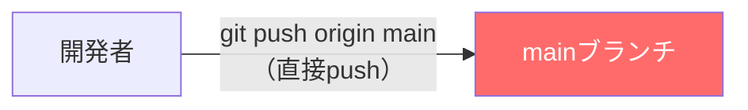
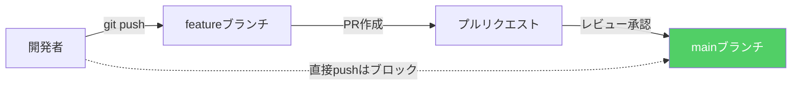
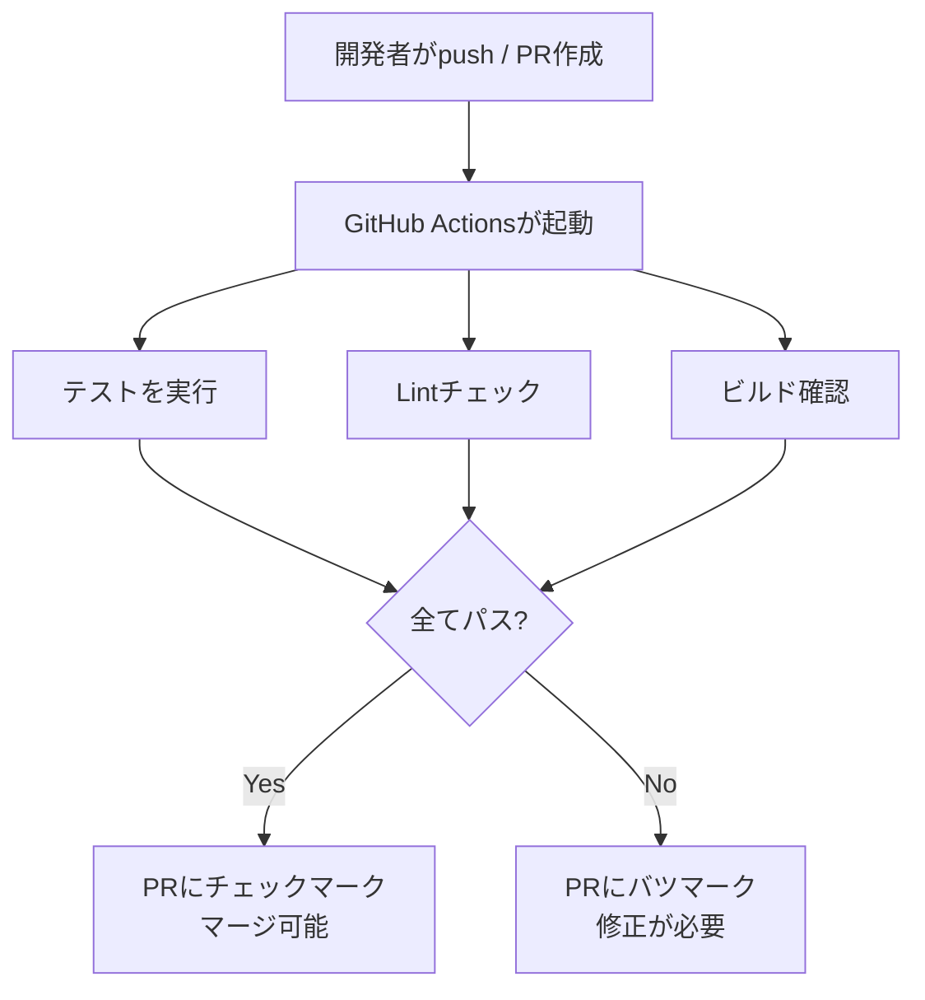
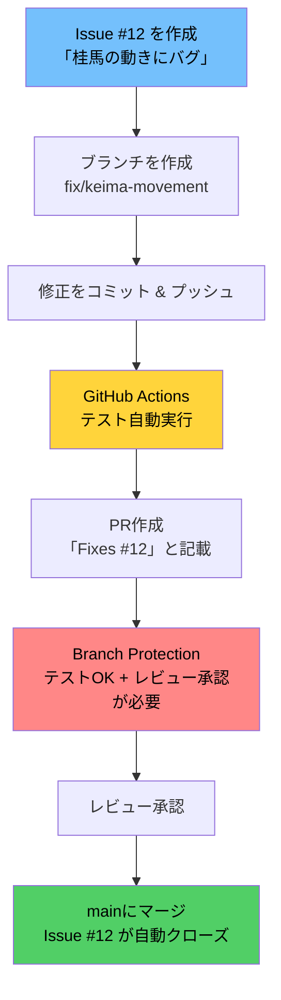

# GitHub便利機能ガイド（Issues / Branch Protection / GitHub Actions）

本ドキュメントでは、開発をより安全・効率的に進めるためのGitHub機能を3つ紹介します。
それぞれの「目的」「なぜ必要か」「実用例」を初心者向けに解説します。

---

## 目次

1. [Issues（イシュー）](#1-issuesイシュー)
2. [Branch Protection Rules（ブランチ保護ルール）](#2-branch-protection-rulesブランチ保護ルール)
3. [GitHub Actions（自動化）](#3-github-actions自動化)

---

## 1. Issues（イシュー）

### これは何？

Issueは「やること・気づいたこと」を記録するチケットです。
バグ報告、新機能の要望、タスクの管理など、開発に関するあらゆることを記録できます。

### なぜ必要？

- 「あのバグ、どうなった？」を防ぐ ― 口頭やチャットだと流れてしまう情報を残せる
- PRと紐づけることで「この変更は何のためか」が明確になる
- チーム全員が今何が起きているかを把握できる

### 実用例

#### 例1: バグ報告

```markdown
タイトル: 二歩の判定が成歩に対しても発動してしまう

## 現象
成った歩（と金）がある筋に歩を打とうとすると、二歩と判定されて打てない。

## 再現手順
1. 歩を敵陣に進めて成る（と金にする）
2. 同じ筋に持ち駒の歩を打とうとする
3. 「二歩です」とエラーが出る

## 期待する動作
と金は「成り駒」なので、同じ筋に歩を打てるべき。

## 環境
- ブラウザ: Chrome 125
- OS: macOS
```

#### 例2: 新機能の提案

```markdown
タイトル: 駒音（効果音）の実装

## 概要
駒を盤面に置いたときに「パチッ」という効果音を鳴らしたい。

## 背景
CLAUDE.mdに「駒音は将棋の臨場感に不可欠」と記載あり。
対局の臨場感を高めるために優先度高で実装したい。

## 必要な作業
- [ ] 効果音ファイルの選定・用意
- [ ] 駒を置いたときの再生処理
- [ ] 音量調整・ミュート設定
```

#### 例3: タスク管理

```markdown
タイトル: 将棋エンジン Phase1 実装タスク

- [ ] 駒の型定義
- [ ] 盤面の初期配置
- [ ] 各駒の移動ルール実装
- [ ] 合法手生成
- [ ] 王手判定
- [ ] 二歩判定
- [ ] テスト作成
```

### IssueとPRの連携

PRの説明文に `Closes #5` と書くと、PRがマージされたときにIssue #5が自動で閉じられます。

| 書き方 | 効果 |
|---|---|
| `Closes #5` | マージ時にIssue #5を自動クローズ |
| `Fixes #5` | 同上（バグ修正時によく使う） |
| `Refs #5` | Issueへのリンクのみ（自動クローズしない） |

### ラベルの活用

Issueにラベル（タグ）を付けると分類しやすくなります。

| ラベル | 用途 |
|---|---|
| `bug` | バグ報告 |
| `feature` | 新機能 |
| `documentation` | ドキュメント関連 |
| `shogi-engine` | 将棋エンジン関連 |
| `UI` | 画面・デザイン関連 |
| `good first issue` | 初心者が取り組みやすいタスク |

---

## 2. Branch Protection Rules（ブランチ保護ルール）

### これは何？

mainブランチ（本番用のコード）に対して「勝手に変更できないルール」を設定する機能です。
PRとレビューを必ず通すことを強制できます。

### なぜ必要？

- **事故防止**: mainに直接pushして本番コードを壊す事故を防ぐ
- **品質の担保**: 必ず誰かのレビューを通すことで、バグの混入を減らせる
- **チームの安心感**: 「mainは常に動く状態」という信頼を維持できる

### 何が起きるか（Before / After）

**保護ルールなし（Before）**



> 誰でもmainに直接pushできてしまう。バグがあっても気づかず本番に反映される。

**保護ルールあり（After）**



> mainへの直接pushは拒否される。必ずPR → レビュー → マージの流れを通る。

### 設定方法

1. GitHubリポジトリページ → **Settings** → **Branches**
2. 「Add branch protection rule」をクリック
3. Branch name pattern に `main` と入力
4. 以下を推奨設定としてチェック:

| 設定項目 | 意味 | 推奨 |
|---|---|---|
| **Require a pull request before merging** | マージにはPRが必須 | ON |
| **Require approvals (1)** | 最低1人のレビュー承認が必要 | ON |
| **Require status checks to pass** | CI（GitHub Actions）が通ること | ON（Actions設定後） |
| **Do not allow bypassing the above settings** | 管理者にも同じルールを適用 | 任意 |

### 設定後に起きること

```bash
# mainに直接pushしようとすると...
$ git push origin main
remote: error: GH006: Protected branch update failed for refs/heads/main.
remote: error: Required status check is expected.
# → 拒否される（正しい動作）
```

---

## 3. GitHub Actions（自動化）

### これは何？

コードをpushしたりPRを作成したときに、テストやビルドを**自動で実行**してくれる仕組みです。
「CI/CD（継続的インテグレーション / 継続的デリバリー）」の基盤です。

### なぜ必要？

- **テストの実行忘れ防止**: pushするだけで自動的にテストが走る
- **壊れたコードの検知**: マージ前に問題を見つけられる
- **手作業の削減**: ビルド・デプロイなどの定型作業を自動化

### 仕組み



### 実用例: テストとLintの自動実行

GitHub Actionsはリポジトリ内の `.github/workflows/` にYAMLファイルを置くことで設定します。

**ファイル: `.github/workflows/ci.yml`**

```yaml
name: CI

# いつ実行するか
on:
  push:
    branches: [main]        # mainへのpush時
  pull_request:
    branches: [main]        # mainへのPR時

# 何を実行するか
jobs:
  test:
    runs-on: ubuntu-latest  # GitHub提供のLinuxマシン上で実行
    steps:
      # コードを取得
      - uses: actions/checkout@v4

      # Node.jsをセットアップ
      - uses: actions/setup-node@v4
        with:
          node-version: '20'

      # 依存パッケージをインストール
      - run: cd shogi-app && npm ci

      # Lintチェック（コードの書き方チェック）
      - run: cd shogi-app && npm run lint

      # テストを実行
      - run: cd shogi-app && npm test
```

### GitHub上での見え方

PRページにActionsの実行結果が表示されます:

```
  ci / test — All checks have passed     ← 全てOKの場合
  ci / test — Some checks were not successful  ← 失敗の場合
```

レビューアーは「テストが通っている」ことを確認してからレビューできるので、安心感が違います。

### 実用例の応用

| 自動化の例 | 説明 |
|---|---|
| テスト実行 | `npm test` を自動実行 |
| Lintチェック | コーディング規約違反を検出 |
| ビルド確認 | ビルドが壊れていないか確認 |
| 型チェック | TypeScriptの型エラーを検出 |
| デプロイ | mainマージ時に本番環境へ自動デプロイ |

---

## 3つの機能の関係性

これら3つの機能は独立ではなく、組み合わせることで真価を発揮します。



| ステージ | 担当する機能 |
|---|---|
| 「何をするか」を記録 | **Issues** |
| 「コードに問題がないか」を自動チェック | **GitHub Actions** |
| 「チェックとレビューを通さないとマージさせない」 | **Branch Protection** |

---

## まとめ

| 機能 | 一言で言うと | 設定場所 |
|---|---|---|
| **Issues** | 開発のTODOリスト | リポジトリの「Issues」タブ |
| **Branch Protection** | mainを壊させないガードレール | Settings → Branches |
| **GitHub Actions** | 自動テスト・自動チェック | `.github/workflows/*.yml` |

これらを組み合わせることで、**「何をすべきか明確で、品質が自動で担保され、mainが常に安全な状態」** を維持できます。
