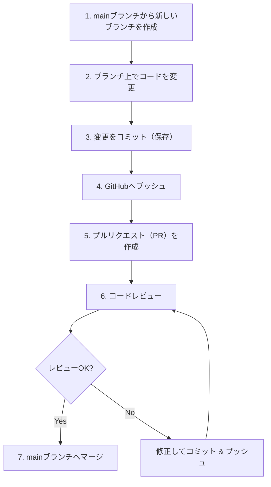
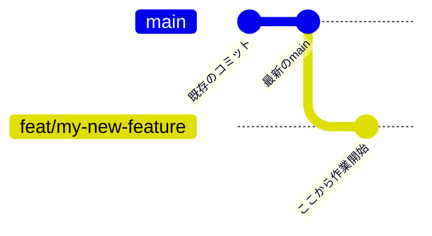
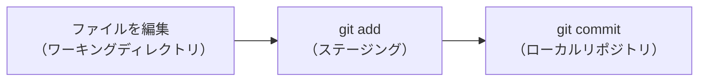
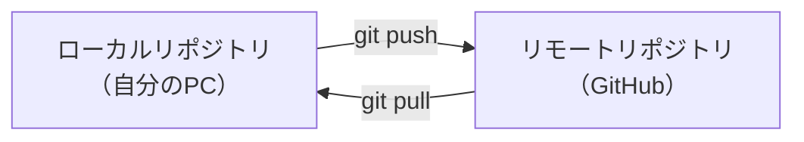
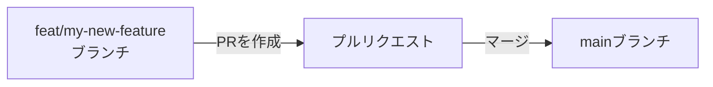
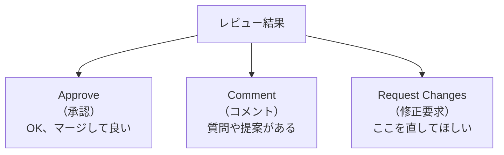
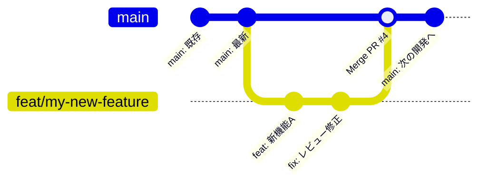

# Git / GitHub 開発フローガイド

本プロジェクトでは、**ブランチを切る → 開発 → プルリクエスト → レビュー → mainに反映** という流れで開発を進めています。
このドキュメントでは、その一連の流れを初心者向けに解説します。

---

## 全体フロー図



---

## 各ステップの詳細解説

### ステップ 1: mainブランチから新しいブランチを作成

**ブランチとは？**
ブランチは「作業用の分岐」です。mainブランチ（本番用の幹）から枝分かれさせて、自分だけの作業スペースを作ります。
こうすることで、mainブランチを壊さずに安全に開発できます。

```bash
# まず最新のmainブランチに切り替える
git checkout main

# リモート（GitHub）の最新状態を取り込む
git pull origin main

# 新しいブランチを作成して切り替える
git checkout -b feat/my-new-feature
```

**ブランチ名の付け方（例）**

| プレフィックス | 用途 | 例 |
|---|---|---|
| `feat/` | 新機能の追加 | `feat/yukaku-theme` |
| `fix/` | バグの修正 | `fix/nifu-validation` |
| `docs/` | ドキュメントの変更 | `docs/add-readme` |
| `refactor/` | コードの整理 | `refactor/game-engine` |



---

### ステップ 2: ブランチ上でコードを変更

作成したブランチ上で、ファイルの追加・変更・削除を自由に行います。
この段階ではまだ自分のPC（ローカル）だけの変更です。

```bash
# 今どのブランチにいるか確認
git branch

# 変更の状態を確認
git status
```

---

### ステップ 3: 変更をコミット（保存）

**コミットとは？**
変更内容に名前（メッセージ）をつけて、Gitの履歴として記録する操作です。
こまめにコミットしておくと、後から「いつ・何を変えたか」がわかります。

```bash
# 変更したファイルをステージング（コミット対象に追加）
git add src/components/Board.tsx
git add src/utils/gameLogic.ts

# コミットメッセージをつけて保存
git commit -m "feat: 盤面コンポーネントの初期実装"
```

**コミットメッセージの書き方**

```
<種類>: <何をしたか（日本語OK）>

例:
feat: 遊郭風ダークテーマを全画面に統一
fix: 二歩判定のバグを修正
docs: 技術スタックドキュメント追加
```



> **ポイント:** `git add .` で全ファイルを一括追加できますが、不要なファイル（`.env` や秘密情報）を含めてしまうリスクがあります。ファイル名を指定して追加するのがおすすめです。

---

### ステップ 4: GitHubへプッシュ

**プッシュとは？**
ローカル（自分のPC）のコミットを、リモート（GitHub）にアップロードする操作です。

```bash
# 初回プッシュ（ブランチをGitHubに作成しつつアップロード）
git push -u origin feat/my-new-feature

# 2回目以降はこれだけでOK
git push
```



---

### ステップ 5: プルリクエスト（PR）を作成

**プルリクエストとは？**
「この変更をmainブランチに取り込んでください」というリクエストです。
GitHubの画面上で作成し、変更内容の説明を書きます。

**作成方法:**

1. GitHubのリポジトリページを開く
2. 「Compare & pull request」ボタンが表示されるのでクリック
3. 以下の情報を記入する:

| 項目 | 内容 |
|---|---|
| **タイトル** | 変更内容を端的に（例: `feat: 遊郭風ダークテーマを全画面に統一`） |
| **説明（Description）** | 何を・なぜ変えたか。レビューアーが理解しやすいように書く |
| **レビューアー** | レビューしてほしい人を指定（Reviewers欄） |

**CLIで作成する場合（GitHub CLI）:**

```bash
gh pr create --title "feat: 盤面UIの初期実装" --body "## 概要
- 9x9の盤面描画を実装
- 駒の初期配置を表示

## テスト方法
- npm run dev でローカル起動して確認"
```



---

### ステップ 6: コードレビュー

**コードレビューとは？**
他のメンバーが変更内容を確認し、問題がないかチェックする工程です。
品質を保ち、バグの混入を防ぐために非常に重要です。

**レビューで確認すること（例）:**

- コードが正しく動作するか
- 将棋のルールに沿った実装になっているか
- 読みやすいコードになっているか
- セキュリティ上の問題がないか

**レビューの結果は3種類:**



**修正を求められた場合:**

同じブランチで修正してコミット & プッシュすれば、PRに自動で反映されます。

```bash
# 修正を加えた後
git add src/components/Board.tsx
git commit -m "fix: レビュー指摘を反映 - 座標表記を修正"
git push
```

---

### ステップ 7: mainブランチへマージ

レビューが承認されたら、PRをmainブランチにマージ（統合）します。

**マージ方法:**

1. GitHub上のPRページで「Merge pull request」ボタンをクリック
2. 「Confirm merge」をクリック
3. マージ完了後、不要になったブランチを削除する（「Delete branch」ボタン）



**マージ後のローカル作業:**

```bash
# mainブランチに切り替えて最新を取り込む
git checkout main
git pull origin main

# マージ済みのブランチを削除（ローカル）
git branch -d feat/my-new-feature
```

---

## よくあるコマンドまとめ

| やりたいこと | コマンド |
|---|---|
| 現在のブランチ確認 | `git branch` |
| ブランチの作成&切り替え | `git checkout -b ブランチ名` |
| 変更状態の確認 | `git status` |
| 変更差分の確認 | `git diff` |
| ファイルをステージング | `git add ファイル名` |
| コミット | `git commit -m "メッセージ"` |
| GitHubへプッシュ | `git push` |
| GitHubから最新を取得 | `git pull origin main` |
| ブランチを切り替え | `git checkout ブランチ名` |
| コミット履歴を確認 | `git log --oneline` |
| PRを作成（CLI） | `gh pr create` |

---

## トラブルシューティング

### mainブランチに直接コミットしてしまった

```bash
# まだpushしていなければ、コミットを新しいブランチに移せる
git branch feat/my-work        # 今のコミットを含むブランチを作成
git checkout main               # mainに戻る
git reset --soft HEAD~1         # mainの最後のコミットを取り消し（変更は保持）
git checkout feat/my-work       # 作業ブランチに切り替えて続行
```

### pushしようとしたらリモートの方が新しいと言われた

```bash
# まずリモートの変更を取り込む
git pull origin feat/my-new-feature

# コンフリクト（衝突）があれば手動で解消してからコミット
```

### コンフリクト（衝突）が起きた

同じファイルの同じ箇所を複数人が変更した場合に発生します。

```
<<<<<<< HEAD
自分の変更内容
=======
他の人の変更内容
>>>>>>> origin/main
```

上記のマーカーを見つけて、正しい内容に手動で修正し、マーカーを削除してからコミットします。

---

## 参考: 本プロジェクトの実際の例

本プロジェクトのPR履歴を見ると、この流れが実践されていることが確認できます:

| PR | ブランチ | 内容 |
|---|---|---|
| #1, #2, #3 | `feat/yukaku-theme` | 遊郭風ダークテーマの実装 |

```bash
# 実際のコミット履歴（git log --onelineより）
680029a Merge pull request #3 from Kengo55555/feat/yukaku-theme
eb2871f docs: 技術スタックドキュメント追加 + Claude設定更新
653b20a Merge pull request #2 from Kengo55555/feat/yukaku-theme
26d9b98 feat: 遊郭風ダークテーマを全画面に統一 + CPU選択UIの改善
7bfddcd Merge pull request #1 from Kengo55555/feat/yukaku-theme
```

このように `feat/yukaku-theme` ブランチで開発し、PRを通じてmainにマージされています。
